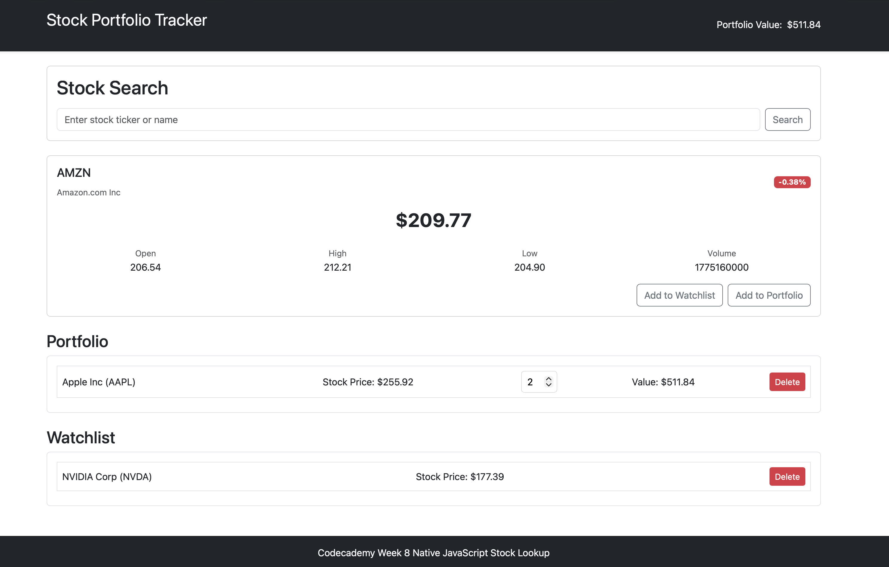

## Codecademy Stock Lookup Using Native JavaScript Major Project

### Points
The index page uses Bootstrap for styling with a local css file for additional styling. There is a separate JavaScript file DOM manipulation.

A main stock display box exists with on-demand div elements created for stocks added to the portfolio or watchlist. The JavaScript file calls finnhub.io. The company name or stock ticker can be used as the search query. The API is called twice. The first time to resolve the stock ticker/symbol. The second API call used the resolved ticker to retreive the stock details. The API does not provide a volume value in the reply, so the UNIX time is rendered to simulate volume on the page.

### Warning
Portfolio and watchlist stocks are saved to browser's local storage to survive page refreshes. The delete button removes them from local storage. 

Clearing the browser history will also clear all local storage objects saved by this page.

### Showcase

